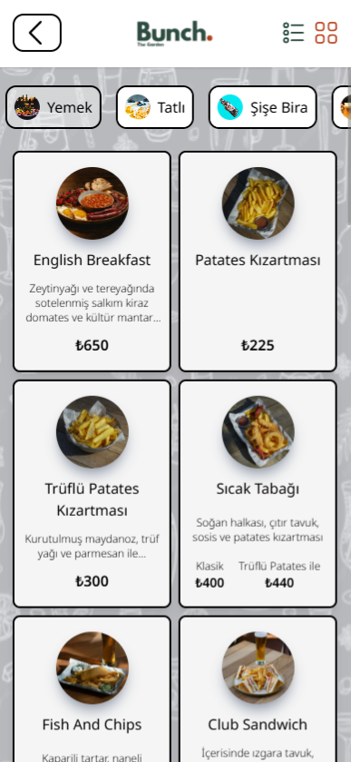
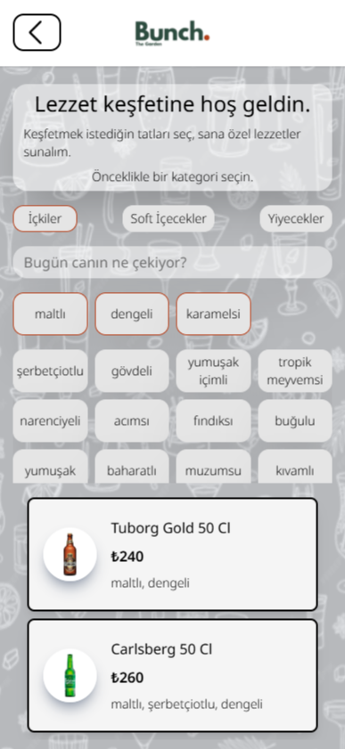

# 🍴 Bunch The Garden Menu

An interactive **React + Vite + Tailwind** web app for exploring the **Bunch The Garden** restaurant & bar menu.  
Users can browse categories, filter by tastes, and even spin a wheel to let chance pick their next order!

This is a **personal self-development project** — it is **not an official or real menu** for Bunch The Garden. The goal of this project is to practice React, Vite, Tailwind, and data-driven UI development while building an interactive QR-style menu.

## 🚀 Tech Stack

- [React 19](https://react.dev) – component-based UI
- [React Router 7](https://reactrouter.com) – routing
- [Tailwind CSS v4](https://tailwindcss.com) – styling
- [Konva + React Konva](https://konvajs.org) – spin wheel animation
- [Vite 7](https://vitejs.dev) – fast bundler & dev server
- [UUID](https://www.npmjs.com/package/uuid) – unique IDs
- [ESLint 9](https://eslint.org) – linting

## 📱 Responsiveness

- Pages are fully **responsive**, but the layout and styling are **primarily optimized for mobile devices**, since this project is designed as a **QR code menu**.
- Works well on small screens; still viewable on tablet/desktop.

## 📂 Project Structure

```
src/
├─ pages/ # Page-level components
│ ├─ Home.jsx
│ ├─ Category.jsx
│ ├─ Find.jsx
│ └─ SpinWheel.jsx
│
├─ components/ # UI building blocks
│ ├─ Navbar.jsx
│ ├─ BgImg.jsx
│ ├─ CategoryCard.jsx
│ ├─ CategoryBox.jsx
│ ├─ TasteBox.jsx
│ ├─ MenuItemCard.jsx
│ ├─ MiniCategoryCard.jsx
│ ├─ MiniItemCard.jsx
│ ├─ LuckyItemCard.jsx
│ └─ Wheel.jsx
│
├─ data/ # Data layer
│ ├─ categories.js # Menu categories
│ ├─ items.js # Menu items with prices & tastes
│ └─ tastes.js # Aggregated tastes by type
│
├─ App.jsx # Router config
├─ main.jsx # React entry
├─ index.css # Tailwind config + custom utilities
└─ index.html # HTML shell

```

## ✨ Features

- **Home Page**
  - Browse all categories (food, drinks, desserts, etc.)
  - Quick access to “Find by Taste” and “Spin the Wheel”
- **Category Page**
  - Grid/List toggle for menu items
  - Horizontal scroll mini-category selector
  - Scroll-to-top button
- **Find Page**
  - Filter items by tastes (salty, sweet, spicy, etc.)
  - Combine multiple tastes to refine results
- **Spin the Wheel**
  - Add menu items to the wheel
  - Spin with Konva.js animation
  - Highlights the winning wedge
  - Displays selected lucky item with full details

## 📸 Screenshots

### Home Page


### Category Page



### Find Page



### Spin the Wheel Page


## ⚙️ Installation & Setup

1. Clone the repo

   ```bash
   git clone https://github.com/your-username/bunch-menu.git
   cd bunch-menu
   ```

2. Install dependencies

   ```bash
   npm install
   ```

3. Run the dev server

   ```bash
   npm run dev
   ```

   → App will be available at [http://localhost:5173](http://localhost:5173)

4. Build for production

   ```bash
   npm run build
   npm run preview
   ```

## 🧑‍💻 Development Notes

- Tailwind fonts configured: `Outfit`, `Lexend Deca`, `Noto Sans`
- ESLint allows uppercase unused vars for env-like constants
- Background image (`/images/drinks_bg.PNG`) and logo (`/images/bunch_logo.png`) included in `/public/images/`

## 📜 Disclaimer

This project was created for learning and self-development purposes only.
It does not represent an actual menu of Bunch The Garden.
